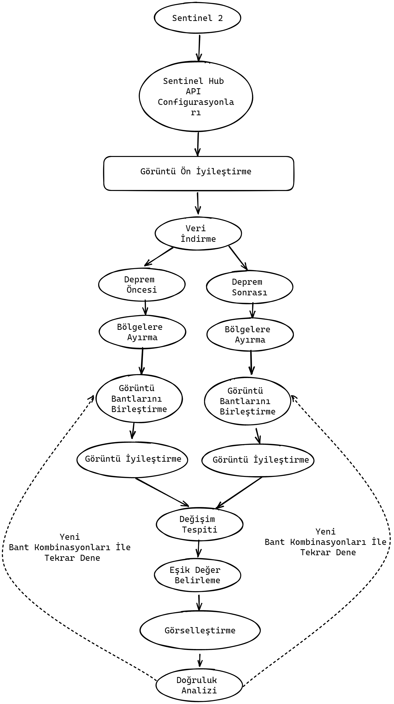

# Değişim Tespit(Differenc Analysis

Uygulama, bir bölgenin, iki farklı zamanda çekilen uydu görğntğlerinin karşılaştırılmasını sağlar.
Bunun için Sentinel-2 L2A uydu görüntülerini kullanır. 

## Genel Akış Şeması

Projenin işlem nbasamakları



Projeyi çalıştırmadan önce recources dosyası altında yer alan parametrelerin değiştilmesi gerekmektedir.
- secrets.env
- mapConfigWCS_before.json //indirilecek görüntünün koordinatlarını ve özellklerini bleritir.
- mapConfigWCS_after.json
- AdiyamanBolgelerGeo.json //indirlen tiff dosyasını parçalara bölmek için gereklidir.

# Kurulum

Projeyi çalıştırmak için aşağıdaki kütüphanelerin kurulu olması gerekmektedir:

- `glob`: Dosya eşleştirmeleri için kullanılır. Kurulum için:
  ```bash
  pip install glob2
  
- `seaborn`: Veri görselleştirmesi için kullanılır. Kurulum için:
    ```bash
  pip install seaborn
  
- `numpy`: Dizi işlemleri için kullanılır. Kurulum için:
  ```bash
    pip install numpy

- `rasterio`: Raster verilerini okumak ve yazmak için kullanılır. Kurulum için:
    ```bash
    pip install rasterio

- `sentinelhub`: Uydu görüntülerine erişim sağlamak için kullanılır. Kurulum için:
    ```bash
    pip install sentinelhub

- `PIL`: Görüntü işleme için kullanılır. Kurulum için:
    ```bash
    pip install pillow

- `matplotlib`: Grafik çizimi için kullanılır. Kurulum için:
    ```bash
    pip install matplotlib

- `geopandas`: Coğrafi veri işleme için kullanılır. Kurulum için:
    ```bash
    pip install geopandas

- `skimage`: Görüntü işleme için kullanılır. Kurulum için:
    ```bash
    pip install scikit-image
  
# Çalıştırma

- ```bash
   cd ucs637_difference_analysis/Core
 
- ```bash
  cd ucs637_difference_analysis/Core

- ```bash
  python analyser.py
  
Bu işlem sonucunda parametrelerdeki değerler de doğru ayarlanmış ise
ucs637_difference_analysis/Core/images
dosyasının altında proje çıktıları oluşur.

- 1.raw
- 2.masked
- Bant Kombinasyonu //şu an tanımlı 13 tane bant kombinasyonu var
  - 3.stack
  - 4.normalyzed
  - 5.histogram
  - 6.difference
  - 7.threshold
  - 8.result

Her adım sonucunda bu klasörlerde çıktılar oluşmaktadır. 
En sonda result klasörünün altında fark görüntüsü, metrikler, confusion matrisleri ve değişen piksel sayıları bölge bölge oluşmaktadır.